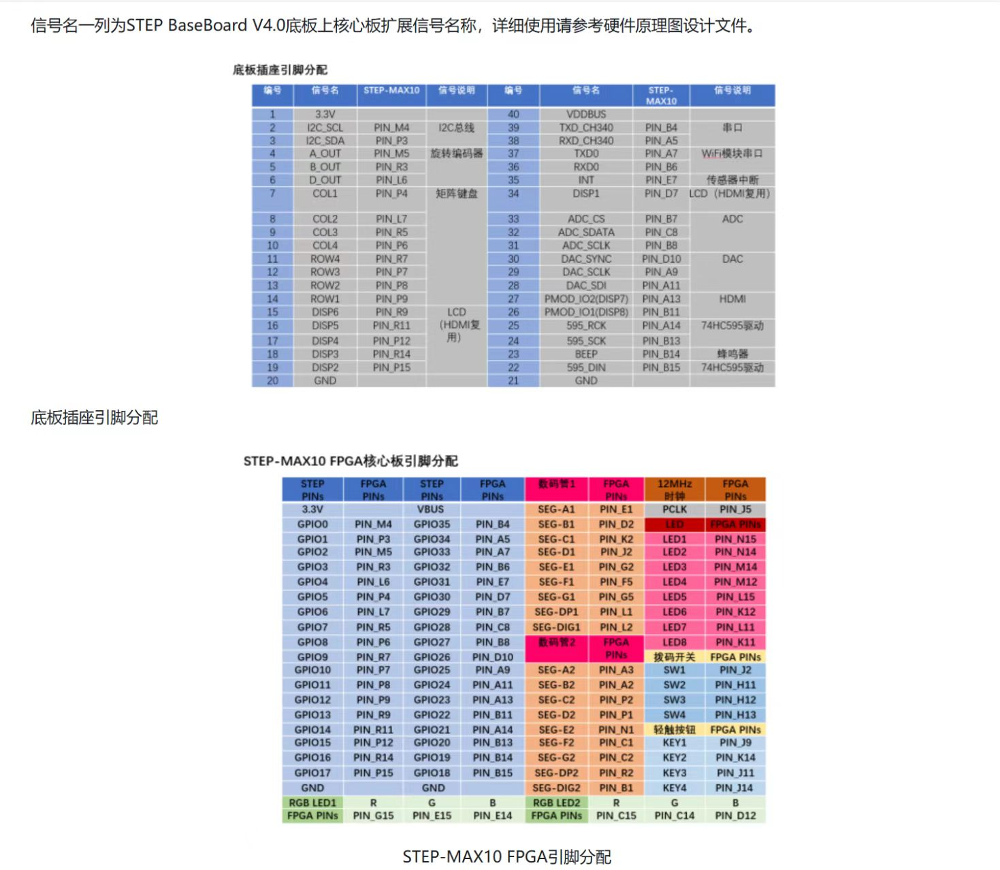

# FPGA 音乐播放器与电子琴

<p align='right'>作者：Xun Wei</p>

首先附上一份引脚定义图


## 项目简介

本工程是一个基于 Intel MAX 10 FPGA 的“音乐播放器 + 电子琴”综合实验项目。工程可以从片内乐谱 ROM 自动播放音乐，也可以通过 4x4 矩阵键盘临时输入音符进行电子琴演奏，最终由蜂鸣器输出方波声音。

工程包含复位、播放、暂停、切歌、倍速播放、歌曲循环播放、矩阵键盘扫描、音符译码和蜂鸣器驱动等功能，适合课程设计、FPGA 入门实验或数字逻辑综合实践展示。

## 功能特性

- 自动播放歌曲：从 MIF 乐谱文件初始化的 ROM 中读取音符并循环播放。
- 支持 4 首歌曲切换：通过切歌按键循环选择 `song0` 到 `song3`。
- 播放控制：支持开始播放、暂停播放和复位。
- 倍速控制：通过 `speed` 输入选择不同乐谱推进速度。
- 电子琴模式：通过 4x4 矩阵键盘输入音符，键盘按下时优先覆盖自动播放音符。
- 蜂鸣器发声：根据音符译码结果产生不同频率的方波。
- 按键消抖：普通机械按键经过消抖模块处理，避免一次按下被识别为多次触发。

## 工程环境

| 项目 | 内容 |
| --- | --- |
| Quartus 工程文件 | `bofangqi.qpf` |
| Quartus 版本 | Quartus Prime 18.1.0 Lite Edition |
| FPGA 系列 | Intel MAX 10 |
| FPGA 器件 | `10M08SAM153C8G` |
| 顶层实体 | `piano2` |
| 顶层图文件 | `piano2.bdf` |
| 编程文件 | `output_files/bofangqi.sof` |
| 仿真输出 | `simulation/modelsim/` |

当前工程已经完成一次成功编译。根据 `output_files/bofangqi.flow.rpt`，资源使用情况如下：

| 资源 | 使用情况 |
| --- | --- |
| Logic elements | 563 / 8,064，约 7% |
| Registers | 156 |
| Pins | 17 / 112，约 15% |
| PLL | 1 / 1，100% |
| Flow Status | Successful |

## 文件结构

```text
.
├── bofangqi.qpf                  # Quartus 工程入口
├── bofangqi.qsf                  # 器件、顶层、引脚、源文件等工程约束
├── piano2.bdf                    # 顶层原理图连接文件
├── PLL.qip / PLL.v / PLL_bb.v    # PLL IP 相关文件
├── key_debounce_pulse.v          # 普通按键消抖与单脉冲生成
├── player_control.v              # 播放、暂停、切歌、歌曲复位控制
├── tempo_tick.v                  # 根据速度档产生乐谱节拍 tick
├── music_addr_counter.v          # 歌曲 ROM 地址计数器
├── music_rom_song0.v             # 第 0 首歌曲 ROM
├── music_rom_song1.v             # 第 1 首歌曲 ROM
├── music_rom_song2.v             # 第 2 首歌曲 ROM
├── music_rom_song3.v             # 第 3 首歌曲 ROM
├── song_select_mux.v             # 4 首歌曲音符与长度选择
├── matrix_keyboard_scan.v        # 4x4 矩阵键盘扫描
├── keyboard_note_map.v           # 键盘编号到音符编号映射
├── note_source_mux.v             # 自动播放音符和键盘音符选择
├── note_decoder.v                # 音符编号译码为显示码、高音标志和发声参数
├── speaker_driver.v              # 蜂鸣器方波输出
├── *_DATA.mif                    # 乐谱数据文件
├── output_files/                 # Quartus 编译输出
├── simulation/                   # ModelSim 相关仿真输出
├── db/                           # Quartus 编译数据库
└── incremental_db/               # 增量编译数据库
```

## 系统架构

系统的核心数据流如下：

```text
普通按键输入
    -> key_debounce_pulse
    -> player_control
    -> play_en / song_id / song_clear

tempo_tick
    -> music_addr_counter
    -> music_rom_song0~3
    -> song_select_mux
    -> song_note

4x4 矩阵键盘
    -> matrix_keyboard_scan
    -> keyboard_note_map
    -> key_note

song_note + key_note
    -> note_source_mux
    -> note_decoder
    -> speaker_driver
    -> beep
```

自动播放时，系统按照 `tempo_tick` 产生的节拍推进歌曲地址，从当前歌曲 ROM 中读取音符。矩阵键盘有按键按下时，`note_source_mux` 会优先选择键盘音符，因此可以在自动播放过程中临时弹奏电子琴。

## 顶层端口与引脚

顶层实体为 `piano2`。引脚约束来自 `bofangqi.qsf`。

| 顶层端口 | 方向 | 引脚 | 说明 |
| --- | --- | --- | --- |
| `CLK` | 输入 | `PIN_J5` | 系统时钟输入 |
| `RST` | 输入 | `PIN_H11` | 复位输入 |
| `qiege` | 输入 | `PIN_J9` | 切歌按键，低有效按键经消抖后触发 |
| `bofang` | 输入 | `PIN_K14` | 播放/开始按键，低有效按键经消抖后触发 |
| `zanting` | 输入 | `PIN_J11` | 暂停按键，低有效按键经消抖后触发 |
| `speed` | 输入 | `PIN_H12` | 播放速度选择输入 |
| `A[0]` | 输入 | `PIN_P9` | 矩阵键盘行输入，低有效，已配置弱上拉 |
| `A[1]` | 输入 | `PIN_P8` | 矩阵键盘行输入，低有效，已配置弱上拉 |
| `A[2]` | 输入 | `PIN_P7` | 矩阵键盘行输入，低有效，已配置弱上拉 |
| `A[3]` | 输入 | `PIN_R7` | 矩阵键盘行输入，低有效，已配置弱上拉 |
| `B[0]` | 输出 | `PIN_P4` | 矩阵键盘列扫描输出，低有效 |
| `B[1]` | 输出 | `PIN_L7` | 矩阵键盘列扫描输出，低有效 |
| `B[2]` | 输出 | `PIN_R5` | 矩阵键盘列扫描输出，低有效 |
| `B[3]` | 输出 | `PIN_P6` | 矩阵键盘列扫描输出，低有效 |
| `beep` | 输出 | `PIN_B14` | 蜂鸣器方波输出 |
| `LED` | 输出 | `PIN_C15` | 指示输出 |
| `matrix_key_led` | 输出 | `PIN_E15` | 矩阵键盘有效按键指示输出 |

## 主要模块说明

### `key_debounce_pulse.v`

该模块用于普通机械按键输入消抖。外部按键为低有效，未按下时为 `1`，按下时为 `0`。模块内部先进行两级同步，再等待输入稳定一段时间，最后输出：

- `key_level`：当前按键是否处于按下状态。
- `key_press_pulse`：刚按下时产生一个系统时钟周期的脉冲。

本工程中切歌、播放、暂停三个普通按键都适合使用该模块处理。

### `player_control.v`

该模块负责播放器状态控制，输入为三个消抖后的按键脉冲：

- `key_next_pulse`：切换到下一首歌曲。
- `key_play_pulse`：进入播放状态。
- `key_pause_pulse`：进入暂停状态。

输出信号包括：

- `play_en`：播放使能。为 `1` 时歌曲地址可以继续前进，为 `0` 时暂停。
- `song_id[1:0]`：当前歌曲编号，范围为 0 到 3。
- `song_clear`：切歌或复位时清零歌曲地址，让新歌曲从头播放。

复位后，`play_en` 默认为 `1`，`song_id` 默认为 `1`。

### `tempo_tick.v`

该模块把高速系统时钟分频为较慢的乐谱推进脉冲 `tick`。`music_addr_counter` 只在收到 `tick` 时才会让歌曲地址前进一步。

模块参数如下：

| 参数 | 默认值 | 说明 |
| --- | --- | --- |
| `CLK_HZ` | `12000000` | 输入时钟频率，默认按 12 MHz 设计 |
| `SLOW_HZ` | `4` | 慢速档每秒 tick 数 |
| `FAST_HZ` | `10` | 快速档每秒 tick 数 |

当前源码中 `speed_sw` 为 `1` 时选择 `SLOW_HZ`，为 `0` 时选择 `FAST_HZ`。

### `music_addr_counter.v`

该模块是歌曲 ROM 地址计数器。它根据 `play_en`、`tick`、`clear` 和 `song_len` 控制当前播放地址：

- `clear=1` 时地址清零。
- `play_en=1` 且 `tick=1` 时地址加 1。
- 播放到 `song_len - 1` 后自动回到 0，实现循环播放。
- 暂停时地址保持不变。

### `music_rom_song0.v` 到 `music_rom_song3.v`

这 4 个模块分别保存 4 首歌曲的音符 ROM。每个 ROM 通过 Quartus 支持的 `ram_init_file` 从 MIF 文件初始化。

| 歌曲编号 | ROM 模块 | MIF 文件 | 歌曲长度 |
| --- | --- | --- | --- |
| `song0` | `music_rom_song0.v` | `see_you_again_DATA.mif` | 800 |
| `song1` | `music_rom_song1.v` | `music_DATA.mif` | 136 |
| `song2` | `music_rom_song2.v` | `song2_lanhuacao_DATA.mif` | 128 |
| `song3` | `music_rom_song3.v` | `song3_wohewodezuguo_DATA.mif` | 456 |

ROM 输出当前地址对应的 4 位音符编号，并同时输出该歌曲长度 `song_len`。

### `song_select_mux.v`

该模块根据 `song_id` 从 4 个歌曲 ROM 输出中选择当前歌曲：

- `song_id=0`：选择 song0。
- `song_id=1`：选择 song1。
- `song_id=2`：选择 song2。
- `song_id=3`：选择 song3。

它同时选择当前歌曲的音符 `song_note` 和歌曲长度 `song_len`。

### `matrix_keyboard_scan.v`

该模块扫描 4x4 低有效矩阵键盘：

- `row_n[3:0]`：行输入，低有效。
- `col_n[3:0]`：列输出，低有效轮流扫描。
- `key_valid`：当前是否检测到有效按键。
- `key_code[3:0]`：按键编号，范围为 0 到 15。

扫描逻辑会依次拉低 4 列输出，如果某一行读到低电平，就得到对应的键盘编号。

### `keyboard_note_map.v`

该模块把矩阵键盘编号转换为音符编号。音符编号约定如下：

| 音符编号 | 含义 |
| --- | --- |
| `0` | 休止或不发声 |
| `1` 到 `7` | 中音区 1 到 7 |
| `8` 到 `14` | 高音区 1 到 7 |
| `15` | 更高一级的 1 |

当前键盘映射中，`key_code=7` 和 `key_code=15` 输出为休止符 `0`，其余按键映射到对应音符。

### `note_source_mux.v`

该模块选择最终送入发声链路的音符来源：

- 无矩阵键盘按下时，选择自动播放的 `song_note`。
- 矩阵键盘有有效按键时，选择键盘输入的 `key_note`。

因此电子琴输入优先级高于歌曲自动播放。

### `note_decoder.v`

该模块把 4 位音符编号转换为发声和显示相关信号：

- `code[3:0]`：音符显示码，可用于显示 1 到 7。
- `high`：高音区标志。
- `tone_reload[10:0]`：蜂鸣器计数装载值，用于决定输出音调。

当 `note_in=0` 时，`tone_reload=11'h7ff`，`speaker_driver` 会保持静音。

### `speaker_driver.v`

该模块根据 `tone_reload` 产生蜂鸣器方波。计数器从 `tone_reload` 开始向上计数，到 `11'h7ff` 时翻转一次 `spk` 输出。

- `tone_reload` 越接近 `11'h7ff`，计数越快溢出，蜂鸣器翻转越快，音调越高。
- `mute=1` 或 `tone_reload=11'h7ff` 时，输出保持静音。

## 操作说明

### 复位

按下或触发 `RST` 后，系统回到初始状态。播放器控制模块会重新初始化播放状态和歌曲编号，歌曲地址也会被清零。

### 开始播放

按下 `bofang` 对应按键后，`player_control` 将 `play_en` 置为 `1`。此时每当 `tempo_tick` 产生一次 `tick`，歌曲地址就前进一步，播放器继续自动播放。

### 暂停播放

按下 `zanting` 对应按键后，`play_en` 被置为 `0`。歌曲地址停止增加，当前歌曲暂停在当前位置。

### 切歌

按下 `qiege` 对应按键后，`song_id` 加 1，并产生 `song_clear` 脉冲。歌曲编号为 2 位，因此会在 0、1、2、3 之间循环。切歌后地址清零，新歌曲从头开始播放。

### 倍速控制

`speed` 输入连接到 `tempo_tick` 的 `speed_sw`。当前源码参数中：

- `speed=1`：使用 `SLOW_HZ=4`，歌曲推进较慢。
- `speed=0`：使用 `FAST_HZ=10`，歌曲推进较快。

如果实际开发板开关方向与预期相反，可以在顶层连接或 `tempo_tick.v` 中调整速度选择逻辑。

### 电子琴弹奏

4x4 矩阵键盘由 `A[3:0]` 和 `B[3:0]` 连接：

- `A[3:0]` 为低有效行输入。
- `B[3:0]` 为低有效列扫描输出。

当键盘被按下时，`matrix_keyboard_scan` 输出有效按键编号，`keyboard_note_map` 将编号转换为音符。只要 `key_valid=1`，键盘音符就会优先送入 `note_decoder`，因此可以直接听到电子琴演奏音。

## 编译与下载步骤

1. 打开 Quartus Prime 18.1.0 Lite Edition。
2. 选择 `File -> Open Project`，打开 `bofangqi.qpf`。
3. 确认顶层实体为 `piano2`，器件为 `10M08SAM153C8G`。
4. 执行 `Processing -> Start Compilation`，或依次执行 Analysis & Synthesis、Fitter、Assembler、Timing Analyzer。
5. 编译成功后，确认生成 `output_files/bofangqi.sof`。
6. 打开 `Tools -> Programmer`。
7. 连接 FPGA 下载器，选择 `output_files/bofangqi.sof`。
8. 点击 `Start` 下载到开发板。
9. 下载完成后，通过按键、拨码开关和矩阵键盘测试播放与电子琴功能。

## 修改或新增乐谱

乐谱由 MIF 文件保存，每个地址存放一个 4 位音符编号。若要修改歌曲：

1. 编辑对应的 `*_DATA.mif` 文件。
2. 保持数据宽度为 4 位，音符编号遵守本工程约定。
3. 如果歌曲长度发生变化，需要同步修改对应 `music_rom_song*.v` 中的：
   - ROM 数组深度，例如 `mem [0:799]`。
   - `song_len` 输出值。
   - 地址越界判断值。
4. 重新编译 Quartus 工程，使新的 MIF 内容写入综合结果。
5. 重新下载 `output_files/bofangqi.sof`。

音符编号建议按下表使用：

| 编号 | 含义 |
| --- | --- |
| `0` | 休止 |
| `1` | 中音 1 |
| `2` | 中音 2 |
| `3` | 中音 3 |
| `4` | 中音 4 |
| `5` | 中音 5 |
| `6` | 中音 6 |
| `7` | 中音 7 |
| `8` | 高音 1 |
| `9` | 高音 2 |
| `10` | 高音 3 |
| `11` | 高音 4 |
| `12` | 高音 5 |
| `13` | 高音 6 |
| `14` | 高音 7 |
| `15` | 更高一级 1 |

## 常见问题

### 下载后没有声音

- 检查 `beep` 是否正确连接到蜂鸣器引脚 `PIN_B14`。
- 检查蜂鸣器是否需要额外使能或电源连接。
- 检查当前音符是否为 `0`，休止符不会发声。
- 检查 `speaker_driver` 的 `mute` 输入是否一直为 `1`。
- 检查系统时钟和 PLL 是否正常工作。

### 播放、暂停或切歌按键无效

- 确认 `qiege`、`bofang`、`zanting` 引脚连接是否与开发板一致。
- 普通按键按低有效设计，未按下应为高电平，按下应为低电平。
- 检查按键是否经过 `key_debounce_pulse` 消抖输出。
- 如果按键触发很慢或不触发，检查 `DEBOUNCE_CNT_MAX` 是否与实际时钟频率匹配。

### 切歌后没有从头播放

- 检查 `player_control` 的 `song_clear` 是否连接到 `music_addr_counter` 的 `clear`。
- `song_clear` 只在切歌或复位时产生短脉冲，波形观察时需要注意触发条件。

### 播放速度不符合预期

- 检查 `tempo_tick.v` 中的 `CLK_HZ` 是否与实际系统时钟一致。
- 当前默认按 12 MHz 计算，如果 PLL 或系统时钟不同，需要重新计算参数。
- 当前源码中 `speed=1` 为慢速，`speed=0` 为快速。如果板上开关方向相反，可以调整逻辑。

### 矩阵键盘按下后自动播放音符被覆盖

这是当前设计的正常行为。`note_source_mux` 中键盘音符优先级高于自动播放音符，因此只要 `key_valid=1`，输出音符就来自矩阵键盘。

### 修改 MIF 后声音没有变化

- 修改 MIF 后需要重新编译 Quartus 工程。
- 确认对应 ROM 文件中的 `ram_init_file` 指向了正确的 MIF 文件。
- 如果新增或缩短歌曲，确认 `song_len` 与 MIF 中有效数据长度一致。

## 设计特点总结

本工程把音乐播放器和电子琴功能拆分为多个较清晰的模块：按键控制负责状态，节拍模块负责播放速度，ROM 和地址计数器负责乐谱读取，矩阵键盘负责人工输入，译码和驱动模块负责发声。各模块通过简单的控制信号和音符编号连接，便于调试、讲解和后续扩展。

