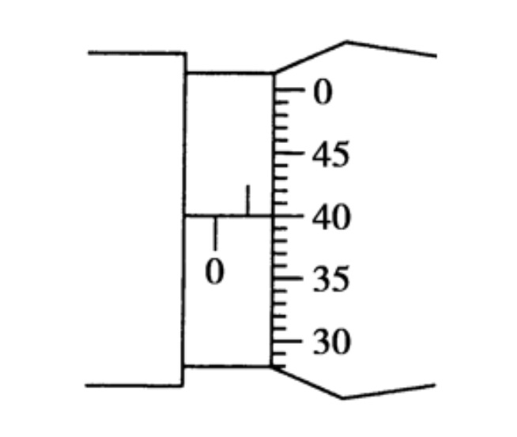
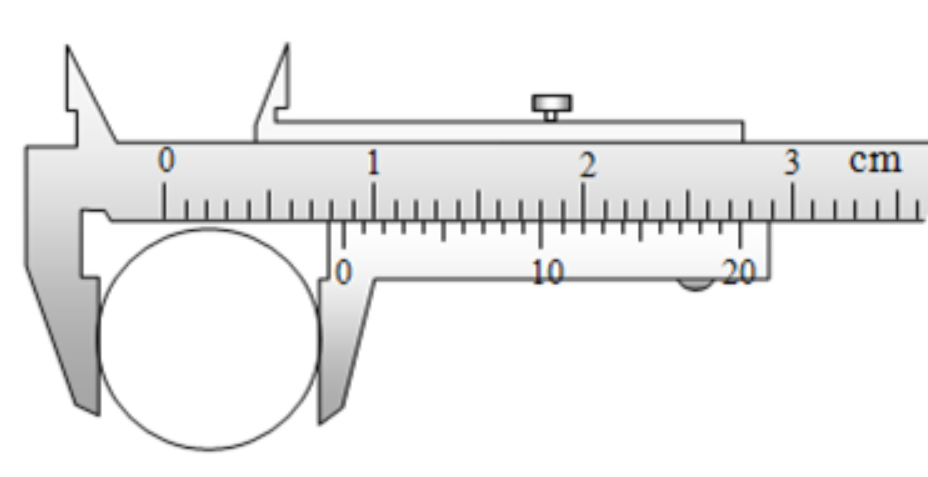

# 螺旋测微器和游标卡尺的读数方法

## 螺旋测微器

螺旋测微器由固定刻度（主尺）和可动刻度（微分筒）组成。主尺下排提供整数毫米刻线（0、1、2、3、4、5…），上排提供半毫米刻线（0.5、1.5、2.5…）。

### 分度值计算

- 分度值 = 螺距 ÷ 可动刻度总分格数
- 螺距：观察主尺，可动刻度完整转动一圈后，主尺额外露出的距离。示例图中该距离为 0.5 mm。
- 可动刻度总分格数：微分筒圆周上的刻度总数。示例图中共有 50 格。

因此分度值为 0.5 mm ÷ 50 = 0.01 mm。

### 读数流程

1. **读固定刻度**：查看可动刻度左侧主尺下排露出的整数毫米刻度（示例为 0 mm），再确认上排半毫米刻线是否露出（示例露出 0.5 mm）。固定刻度读数为 0.5 mm。
2. **读可动刻度**：找到与主尺基准线对齐的微分筒刻度。示例中 40 格与基准线对齐，读数为 40 × 0.01 mm = 0.400 mm，并估读至千分位（示例估读为 0）。
3. **相加得到结果**：总读数 = 0.5 mm + 0.400 mm = 0.900 mm。

---

## 游标卡尺

游标卡尺由主尺与游标尺（副尺）组成，游标尺用于与主尺配合读取更精细的刻度。

### 分度值计算方法

- 分度值 = 主尺最小分度 ÷ 游标尺总格数
- 主尺最小分度是主尺上最小刻度的长度。示例图中游标尺共有 20 格，覆盖主尺上的 19 格，即最小分度为 1 mm。

因此分度值为 1 mm ÷ 20 = 0.05 mm。

### 读数流程

1. **读取主尺**：观察游标尺零刻度线的位置，读取其左侧最近的主尺整数刻度。示例零刻度位于 8 mm 与 9 mm 之间，主尺读数为 8 mm。
2. **读取游标尺**：寻找游标尺上与主尺刻度完全对齐的刻线。示例中第 10 条刻线对齐，读数为 10 × 0.05 mm = 0.50 mm。
3. **相加得到结果**：总读数 = 8 mm + 0.50 mm = 8.50 mm。

